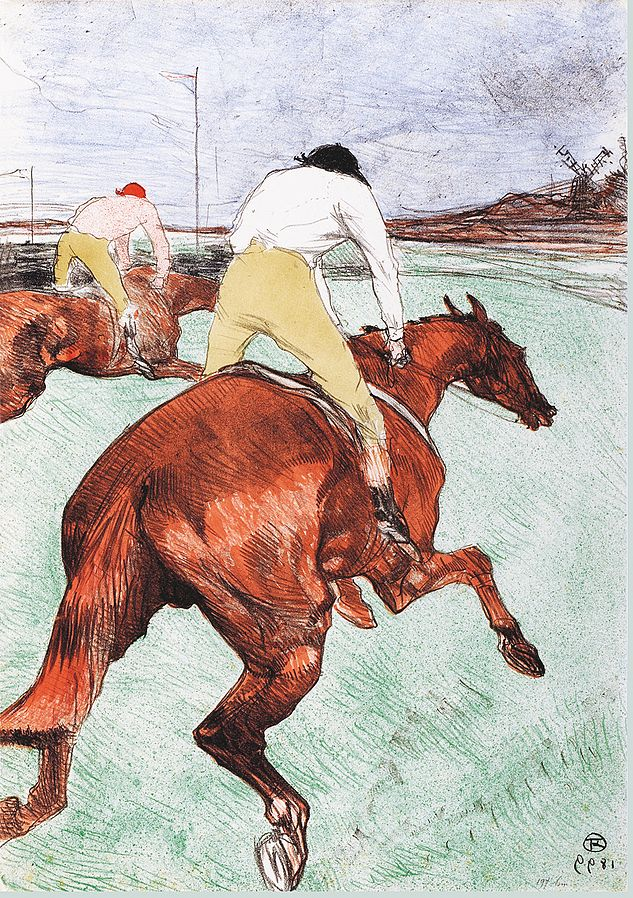

```{r setup, include=FALSE}
knitr::opts_chunk$set(echo = TRUE)
knitr::opts_chunk$set(fig.width=12, fig.height=8, echo = TRUE, fig.align = "center")
```

A couple of months ago, Gordon Burtch shared an excellent Twitter thread on the merits of wild cluster bootstrap inference when the regression error terms are clustered into a small group of clusters:

```{r echo=FALSE}
blogdown::shortcode('tweet', '1378520203689082886')
```

<!-- <blockquote class="twitter-tweet"><p lang="en" dir="ltr">How biased are clustered SEs with &#39;few&#39; clusters? A simulation illustrating this. DGP is y~x, 50 clusters, x is normal, true beta is 0.5. Plot of 1000 sims, beta estimate +95% CIs for each. Red = we did not cover true beta. Std SEs no good, clustered SEs yield ~95% coverage (1/6) <a href="https://t.co/z3eZdy1wb1">pic.twitter.com/z3eZdy1wb1</a></p>&mdash; Gord Burtch (@gburtch) <a href="https://twitter.com/gburtch/status/1378520203689082886?ref_src=twsrc%5Etfw">April 4, 2021</a></blockquote> <script async src="https://platform.twitter.com/widgets.js" charset="utf-8"></script>  -->

In his simulation study, Gordon focused on the wild cluster bootstrap vs regular sandwich cluster robust inference (CRVE). As I am quite invested in the wild cluster bootstrap, I was happy to see that it appeared to outperform 'classical' robust standard errors: in his simulations, the coverage rate of wild clustered bootstrapped confidence intervals is already close to the desired coverage rate of 95% even for a small number of clusters (e.g. 5-10). 

<!-- Have you ever heard of Satterthwaite degree-of-freedom bias-corrections for cluster robust standard error estimation? -->

<!-- Well, I myself have never seen them used in any applied econometrics paper \footnote{As it happens, Angrist \& Lavy ... }. But while writing this blog post, I realized that both the survey paper by [Cameron & Miller](http://cameron.econ.ucdavis.edu/research/Cameron_Miller_JHR_2015_February.pdf) and Mostly Harmless Econometrics both discuss ... -->

Nevertheless, there is a statistical literature that argues that it is fine to use cluster robust sandwich estimators to compute standard errors for a small number of clusters as long as one applies an appropriate **small sample correction** via **Satterthwaite** or **saddlepoint corrections** (Imbens & Kolesar, Bell, Tipton & Pustejovksy).
All these methods are implemented in R via the `clubSandwich` package and in Stata in the [clubSandwich-Stata](https://github.com/jepusto/clubSandwich-Stata) package.

Of course I was curious to see how the Satterthwaite-corrected SEs would perform in comparison to the would cluster bootstrap, so I decided to run some simulations.

Luckily for me, Gordon published all of his code [on github](https://github.com/gburtch/simulating_cluster_SEs), so it was easy for me to slightly tweak it and add simulations for Satterthwaite corrections. Open software is really awesome!

I have collected my minor updates of Gordon's code in an R package, which is available on [github](https://github.com/s3alfisc/clusteredErrorsSims). To reproduce all analyses below, you simply have to install the package by running

```{r, eval = FALSE}
# install.packages("devtools")
devtools::install_github("s3alfisc/clusteredErrorsSims")
```

But before we dive into the simulations, I will start with revising some theory on the consistency of CRVE that will motivate the design of the simulations. 

## When are clustered standard errors biased? 

In general, cluster robust variance estimators will be biased if one of the three conditions below holds: 

1. If there are only very few clusters. 
2. If the cluster sizes are wildly different. 
3. If the intra-cluster correlations varies across clusters. 

In the following simulations, I will focus on cases 1-2 and conduct three simulation studies. The **first** simulation closely follows Gordon's work and investigates the performances of different inference methods for a **small number of clusters G**, but includes simulations for Satterthwaite corrected CRVE estimates via the `clubSandwich` package. The **second** set of simulations investigates the performance for clustered erros with $G \in \{50, 100\}$ clusters, but **wildly different** cluster sizes. Last, I take a look at a special case that has received considerable attention: how do wild cluster bootstrap and Satterthwaite corrected SEs perform when only few clusters are treated (as often happens with Difference-in-Differences identification strategies)? Simulations 2 and 3 are heavily influenced by work by [MacKinnon & Webb](https://ageconsearch.umn.edu/record/274639/files/qed_wp_1314.pdf) on the performance of the wild cluster bootstrap under "wildly different" cluster sizes. 

The data generating process for all simulations is a simple linear regression model for $g = 1, ..., G$ clusters: 

$$
  y_{ig} = \beta_0 + \beta_1 X_{ig} + \epsilon_{ig}
$$

where $E(\epsilon_{ig}|X_{ig}) = 0$, $\beta_0 = 1$, $\beta_1 = 0.5$ and the errors $\epsilon_{ig}$ are simulated to be correlated within $G$ clusters with intra-cluster correlation $\rho$. All errors are uncorrelated across clusters.  

Throughout all simulations, the wild cluster bootstrap will run with $B = 9999$ bootstrap iterations. 

So the stage is set for a `r emo::ji("horse")` race! My champion, of course, is the wild cluster bootstrap, but let's see how the bias-corrected standard errors perform in comparison! 

```{r pressure, echo=FALSE, fig.cap="Toulose-Lautrec, Le Jockey, 1899", out.width = '75%', align="center"}

```

#### Simulation 1: Small number of clusters G & balanced cluster sizes

To initiate the horse race, you simply have to run the `sim_balanced_clusters()` function, though I want to note that on my laptop, this takes around 2h while using multiple cores. 

```{r, eval = FALSE}
library(clusteredErrorsSims)
set.seed(1234)
sim_balanced_clusters(n = 1000, n_sims = 1000, rho = 0.7, workers = 4)
```

Here are the results for the first simulation: 

```{r Result1, echo=FALSE, fig.cap="Simulation results. N = 1000, rho = 0.7, balanced cluster sizes", out.width = '75%', align="center" }

```

There are three takeaways from figure 2: 

+ As expected, inference with non-robust standard errors is severely biased. 
+ Inference via cluster robust estimators tends to under-reject for less than 50 clusters. 
+ The wild cluster bootstrap **and** cluster robust variance estimator with Satterthwaite correction perform astonishingly well for 3 or more clusters. For a number of cluster with of $ 3 \leq G \leq 10$, the Satterthwaite correction seems to perform slightly better than the wild cluster bootstrap, which very mildly under-rejects. 

#### Simulation 2: Wildly different cluster sizes

Instead of simulating balanced cluster sizes, I now follow [MacKinnon & Webb](https://ageconsearch.umn.edu/record/274639/files/qed_wp_1314.pdf) and simulate group sizes that mimic the relative size of the US states (minus Washington DC) for $G=50$ and $G = 100$ clusters. The dgp is unchanged, but in parallel to MacKinnon & Webb's work, I set the number of observations $N$ to $2.000$. I also increase the number of Monte Carlo simulations to `n_sim = 5.000` and repeat the analysis for a range of intra-cluster correlations $\rho$.

```{r Figure 2, echo=FALSE, fig.cap="Simulation results. N = 2000, 50 and 100 clusters, wildly different cluster sizes", out.width = '75%', fig.align="center" }
knitr::include_graphics("wildly_different.png")
```

Both for $G = 50$ and $G = 100$, the wild cluster bootstrap and Satterthwaite corrected errors perform equally well and achieve close to 95% coverage for all intra-cluster correlations $\rho$. The unadjusted CRVE estimates instead tend to under-reject. 

You can reproduce Figure 2 by running 

```{r, eval = FALSE}
wildly_different_sim(n = 2000, n_sims = 5000, workers = 4)
```

Once again, note that this function will run for a very long time. 

#### Treatment Effects

The last simulation investigates a topic that has received considerable attention: regression models where the treatment occurs at the cluster level, but only few clusters are treated (e.g. ["How much should we trust DiD estimates?](https://academic.oup.com/qje/article-abstract/119/1/249/1876068?redirectedFrom=fulltext&login=false)")? For the sake of simplicity, I do not simulate a "full" DiD model with 2-way fixed effects and potential error correlations across time but restrict myself to replacing $X_{ig}$ in the model above by a treatment assignment dummy $D_{ig}$. (Loosely) following MacKinnon & Webb once again, I then simulate $N=2000$ observations with intra-cluster correlation $\rho = 0.5$ and vary the number of clusters that are treated. The simulations are repeated for different treated proportions of clusters $P \in \{1/50, ..., 1\}$, where the clusters are a) of equal size, b) US-state sized and sorted in increasing order and c) US-state sized and sorted in decreasing order \footnote{Note that while MacKinnon & Webb run up to 400.000 Monte Carlo iterations, I restrict myself to `n_sims = 1000` iterations}.   

```{r, eval = FALSE}
treatment_effect_sim(n = 2000, n_sims = 1000, workers = 4)
```

```{r Figure_four, echo=FALSE, fig.cap="Treatment Effect Simulations, N = 2000, 50 clusters, treatment effects. The x axis denotes the share of treated clusters, either in increasing or decreasing cluster size.", out.width = '75%', fig.align="center" }
knitr::include_graphics("treatment_simulations.png")
```

Once again, there is no visible difference in performance between bias-corrected standard errors and the wild cluster bootstrap, but the CRVE tends to overreject in all three scenarios.

## Conclusion

So, when should you use Satterthwaite corrected cluster robust standard errors, and when should you rely on the wild cluster bootstrap in case you are facing a small number of clusters problem or data with wildly different cluster sizes? The honest answer is that I still don't know. My main learning from the simulations above is that the Satterthwaite correction method might perform just as well as the wild cluster bootstrap. 

Overall, I am quite impressed by the performance of the Satterthwaite corrected cluster robust sandwich estimator! 


<!-- ### When the parameter of interest is a treatment effect  -->

<!-- In a final simulation, I investigate the (probably) most popular regression specification in all of economics: the regression specification of a Difference-in-Differences strategy - a two-way fixed effects model with a binary variable $D$, a treatment effect.   -->

<!-- Difference-in-Differences models are usually estimated by an  equation similar to  -->

<!-- $$ -->
<!--   y_{igt} =  -->
<!-- $$ -->

<!-- The parameter of interest ... But what happens if only few clusters are treated? Dangers of the pairs bootstrap - bootstrap samples without any treatment group. Solution wild cluster bootstrap. The paper by MacKinnon & Webb argues that the wild cluster bootstrap performs really well if few clusters are treated. Here, I will replicate MW's analysis for the WCB and compare it with the performance of Satterthwaite corrected robust estimators.  -->

<!-- Again, the data simulating process mimics the equation above. I further set $G = 50$ and the intra-cluster correlation $\rho = $ as in MW. Once again, the sample size is $N = 2000$, and the ...  -->

## Code 

You can find all code to reproduce the analyses above in this [github repo](https://github.com/s3alfisc/clusteredErrorsSims). It's essentially a clone of code written by Gord Burtch - my estimate for a lower bound of the share of Gordon's code is 80%. You can find his code [here](https://github.com/gburtch/simulating_cluster_SEs).

## Literature 

+ [Cameron, Gelbach & Miller - "Bootstrap-based improvements for inference with clustered errors", Review of Economics & Statistics (2008)](https://www.nber.org/system/files/working_papers/t0344/t0344.pdf)
+ [Imbens & Kolesar - "Robust standard errors in small samples: Some practical advice", Review of Economics and Statistics (2016)](https://www.nber.org/system/files/working_papers/w18478/w18478.pdf)
+ [MacKinnon & Webb - "Wild bootstrap inference for wildly different cluster sizes", Journal of Applied Econometrics (2017)](https://ageconsearch.umn.edu/record/274639/files/qed_wp_1314.pdf)
+ [Pustejovsky & Tipton - "Small-sample methods for cluster-robust variance estimation and hypothesis testing in fixed effects models", Journal of Economics and Business Statistics (2018)](https://arxiv.org/pdf/1601.01981.pdf)
+ [Webb - "Reworking wild bootstrap based inference for clustered errors", Working Paper (2013)](https://www.econstor.eu/bitstream/10419/97480/1/757403891.pdf)


