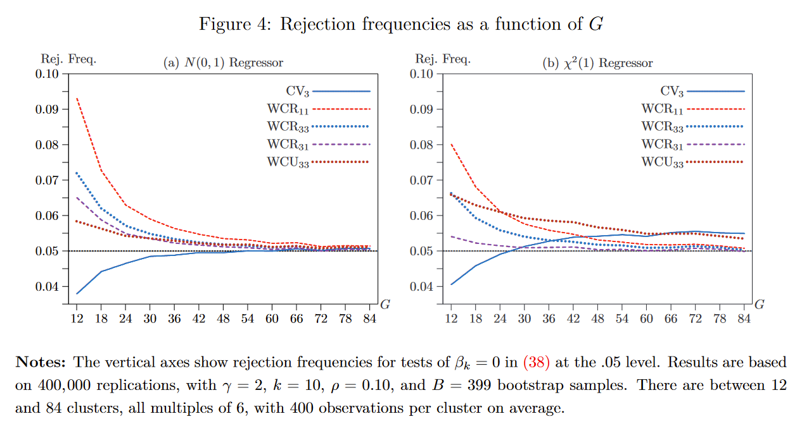

[Aleksandr Michuda](https://amichuda.github.io/) and I have just released version 0.1 of [`wildboottest`](https://github.com/s3alfisc/wildboottest) to [PyPi](https://pypi.org/project/wildboottest/).

`wildboottest` is a Python package to conduct *fast* wild cluster bootstrap inference in Python and implements the wild cluster bootstrap following algorithms sketched out in [MacKinnon (2021)](https://www.sciencedirect.com/science/article/abs/pii/S2452306221001404) and [MacKinnon, Nielsen & Webb, 2022 (MNW)](https://www.econ.queensu.ca/sites/econ.queensu.ca/files/wpaper/qed_wp_1485.pdf).

Most importantly, it supports all eight variants of the wild cluster bootstrap discussed in MNW as well as CRV3 inference via the cluster jackknife. Some of these new variants appear to perform even better than the "standard" (WCR11) wild cluster bootstrap in situations where the textbook CRV1 cluster robust variance estimator is known to struggle. And thanks to the excellent [`numba`](https://github.com/numba/numba) library, it is actually quite fast!

```{r , echo=FALSE, fig.cap="Rejection Frequencies of different Wild Cluster Bootstrap Variants (Figure from MNW (2022), full citation below", out.width = '75%', align="center" }

```

In terms of functionality, `wildboottest` still lacks behind its sister packages (Stata's [boottest](https://github.com/droodman/boottest), R's [fwildcusterboot](https://github.com/s3alfisc/fwildclusterboot) and Julia's [WildBootTests.jl](https://github.com/droodman/WildBootTests.jl)). `wildboottest` supports

-   The wild cluster bootstrap for OLS ([Cameron, Gelbach & Miller 2008](https://direct.mit.edu/rest/article-abstract/90/3/414/57731/Bootstrap-Based-Improvements-for-Inference-with), [Roodman et al (2019)](https://econpapers.repec.org/paper/qedwpaper/1406.htm)).
-   Multiple new versions of the wild cluster bootstrap as described in [MacKinnon, Nielsen & Webb (2022)](https://www.econ.queensu.ca/sites/econ.queensu.ca/files/wpaper/qed_wp_1485.pdf), including the WCR13, WCR31, WCR33, WCU13, WCU31 and WCU33.
-   CRV1 and CRV3 robust variance estimation, including the CRV3-Jackknife as described in [MacKinnon, Nielsen & Webb (2022)](https://arxiv.org/pdf/2205.03288.pdf).

Features that are currently not (yet) supported:

-   The (non-clustered) wild bootstrap for OLS ([Wu, 1986](https://projecteuclid.org/journals/annals-of-statistics/volume-14/issue-4/Jackknife-Bootstrap-and-Other-Resampling-Methods-in-Regression-Analysis/10.1214/aos/1176350142.full)).
-   The subcluster bootstrap ([MacKinnon and Webb 2018](https://academic.oup.com/ectj/article-abstract/21/2/114/5078969?login=false)).
-   Confidence intervals formed by inverting the test and iteratively searching for bounds.
-   Multiway clustering.
-   Regression Weights (Weighted Least Squares / WLS).

You can install the package from PyPi by running

```{bash, eval = FALSE}
pip install wildboottest
```

Here's an small example how to use `wildboottest`:

```{python, eval = FALSE}
from wildboottest.wildboottest import wildboottest
import statsmodels.api as sm
import numpy as np
import pandas as pd

# create data
np.random.seed(12312312)
N = 1000
k = 10
G = 25
X = np.random.normal(0, 1, N * k).reshape((N,k))
X = pd.DataFrame(X)
X.rename(columns = {0:"X1"}, inplace = True)
beta = np.random.normal(0,1,k)
beta[0] = 0.005
u = np.random.normal(0,1,N)
Y = 1 + X @ beta + u
cluster = np.random.choice(list(range(0,G)), N)

# estimation
model = sm.OLS(Y, X)

wildboottest(model, param = "X1", cluster = cluster, B = 9999, bootstrap_type = "11")
#   param              statistic   p-value
# 0    X1  [-1.0530803154504016]  0.308831

wildboottest(model, param = "X1", cluster = cluster, B = 9999, bootstrap_type = "31")
#   param              statistic   p-value
# 0    X1  [-1.0530803154504016]  0.307631

wildboottest(model, param = "X1", cluster = cluster, B = 9999, bootstrap_type = "33")
#   param              statistic   p-value
# 0    X1  [-1.0394791020434824]  0.294286
```

This was the first time I have worked on a Python package, and it has been quite a nice experience - after having used quite a bit of Python at work, I have now actually started to enjoy Python and object oriented programming! The wild cluster bootstrap variants really fit nicely into an OOP framework, and I am really impressed by the `numba` jit compiler. Submitting to PyPi was also a very nice and smooth experience =)

So what are the next steps for `wildboottest`? We need to close a few performance bottlenecks, in particular for the WCRx3 bootstrap types, and then I'd like to add the functionality gaps discussed above. I'd also like to allow users to call `WildBootTests.jl`, which is just blazing fast.

## References

-   MacKinnon - Fast cluster bootstrap methods for linear regression models, 2021, [Econometrics & Statistics](https://www.sciencedirect.com/science/article/abs/pii/S2452306221001404)
-   MacKinnon, Nielsen & Webb - Fast and Reliable Jackknife and Bootstrap Methods for Cluster-Robust Inference, 2022, [Queens University Working Paper No 1485](https://www.econ.queensu.ca/sites/econ.queensu.ca/files/wpaper/qed_wp_1485.pdf)
