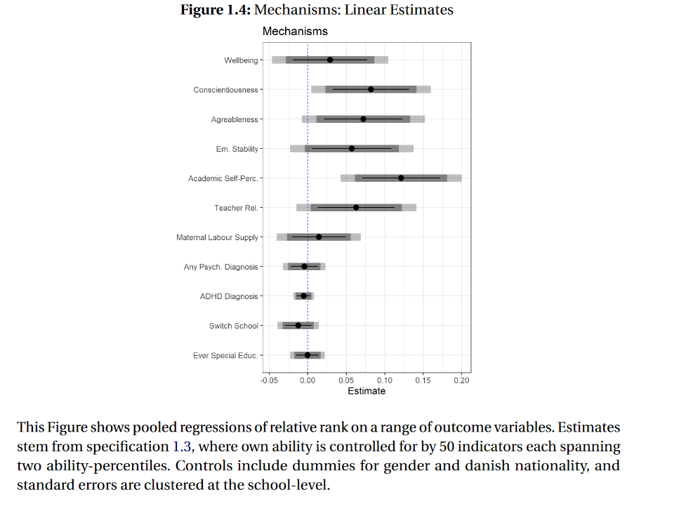

For the final chapter of my dissertation, I had examined the effects of ordinal class rank on the academic achievement of Danish primary school students (following a popular identification strategy introduced in a paper by Murphy and Weinhard). Because of the richness of the Danish register data, I had a large number of potential outcome variables at my disposal, and as a result, I was able to examine literally all the outcomes that the previous literature had covered in individual studies - the effect of rank on achievement, personality, risky behaviour, mental health, parental investment, etc. - in one paper.

```{r , echo=FALSE, fig.cap="The Effect of Ordinal Class Rank on quite a few outcome variables", out.width = '75%', align="center" }

```

But with (too) many outcome variables comes a risk: inflated type 1 error rates, or an increased risk of 'false positives'. So I was wondering: were all the significant effects I estimated - shown in the figure above - "real", or was I simply being fooled by randomness?

A common way to control the risk of false positive when testing multiple hypothesis is to use methods that control the 'family-wise' error rate, i.e. the risk of at least one false positive in a family of S hypotheses.

Among such methods, Romano and Wolf's correction is particularly popular, because it is "uniformly the most powerful". Without going into too much detail, I'll just say that if you have a choice between a number of methods that control the family-wise error rate at a desired level $\alpha$, you might want to choose the "most powerful" one, i.e. the one that has the highest success rate of finding a true effect.

Now, there is actually an amazing Stata package for the Romano-Wolf method called `rwolf`.

But this is an R blog, and I'm an R guy ... In addition, my regression involved several million rows and some high-dimensional fixed effects, and `rwolf` quickly showed its limitations. It just wasn't fast enough!

While playing around with the `rwolf` package, I finally did my due diligence on the method it implements, and after a little background reading, I realized that both the Romano and Wolf method - as well as its main rival, the method proposed by Westfall and Young - are based on the bootstrap!

But wait! Had I not just spent a lot of time [porting a super-fast bootstrap algorithm from R to Stata](https://s3alfisc.github.io/blog/post/1000x-faster-wild-cluster-bootstrap-inference-in-r-with-fwildclusterboot/)? Could I not use Roodman et al's "fast and wild" cluster bootstrap algorithm for bootstrap-based multiple hypothesis correction?

Of course it was inevitable: I ended up writing an R package. Today I am happy to present the first MVP version of the `wildwrwolf` package! 

## The wildrwolf package

You can simply install the package from github or r-universe by typing 


```{r, eval = FALSE, warning = FALSE, message  = FALSE}
# install.packages("devtools")
devtools::install_github("s3alfisc/wildrwolf")

# from r-universe (windows & mac, compiled R > 4.0 required)
install.packages('wildrwolf', repos ='https://s3alfisc.r-universe.dev')
```

The Romano Wolf correction in `wildrwolf` is implemented as a post-estimation commands for multiple estimation objects from the fabulous `fixest` package.

To demonstrate how `wildrwolf's` main function, `rwolf`, works, let's first simulate some data:

```{r, warning = FALSE, message  = FALSE}
library(wildrwolf)
library(fixest)

set.seed(1412)

library(wildrwolf)
library(fixest)

set.seed(1412)

N <- 5000
X1 <- rnorm(N)
X2 <- rnorm(N)
rho <- 0.5
sigma <- matrix(rho, 4, 4); diag(sigma) <- 1
u <- MASS::mvrnorm(n = N, mu = rep(0, 4), Sigma = sigma)
Y1 <- 1 + 1 * X1 + X2 
Y2 <- 1 + 0.01 * X1 + X2
Y3 <- 1 + 0.4 * X1 + X2
Y4 <- 1 + -0.02 * X1 + X2
for(x in 1:4){
  var_char <- paste0("Y", x)
  assign(var_char, get(var_char) + u[,x])
}
group_id <- sample(1:100, N, TRUE)

data <- data.frame(Y1 = Y1,
                   Y2 = Y2,
                   Y3 = Y3,
                   Y4 = Y4,
                   X1 = X1,
                   X2 = X2,
                   group_id = group_id,
                   splitvar = sample(1:2, N, TRUE))
```

We now estimate a regression via the `fixest` package: 

```{r, warning = FALSE, message  = FALSE}
fit <- feols(c(Y1, Y2, Y3, Y4) ~ csw(X1,X2),
             data = data,
             cluster = ~group_id,
             ssc = ssc(cluster.adj = TRUE))

# clean workspace except for res & data
rm(list= ls()[!(ls() %in% c('fit','data'))])
```

For all eight estimated regressions, we want to apply the Romano-Wolf correction to the parameter of interest, `X1`. We simply need to provide the regression object of type `fixest_multi` (it is also possible to simply provide a list of objects of type `fixest`), the parameter of interest, the number of bootstrap draws, and possibly a seed (for replicability). That's it! If the regressions use clustered standard errors, `rwolf` will pick this up and run a wild cluster bootstrap, otherwise just a robust wild bootstrap. 

```{r, warning = FALSE, message  = FALSE}
pracma::tic()
res_rwolf <- wildrwolf::rwolf(
  models = fit,
  param = "X1", 
  B = 9999, 
  seed = 23
)
pracma::toc()
```

For $N=5000$ observations with $G=100$ clusters, $S=8$ hypothesis and $B=9999$ bootstrap draws, the calculation of Romano-Wolf corrected p-values takes less than 5 seconds. If you ask me, that is pretty fast! =) `r emo::ji("rocket")`

We can now compare the results of `rwolf` with the uncorrected p-values and another popular multiple testing adjustment, Holm's method. 

```{r, warning = FALSE, message  = FALSE}
pvals <- lapply(fit, function(x) pvalue(x)["X1"]) |> unlist()
  
df <- 
  data.frame(
    "uncorrected" = pvals, 
  "Holm" = p.adjust(pvals, method = "holm"), 
  "rwolf" = res_rwolf$pval
)
rownames(df) <- NULL
round(df, 3)
```

Both Holm's method and `rwolf` produce similar corrected p-values, which - in general - are larger than the uncorrected p-values. 

## But does it actually work? Monte Carlo Experiments

We test $S=6$ hypotheses and generate data as

$$Y_{i,s,g} = \beta_{0} + \beta_{1,s} D_{i} + u_{i,g} + \epsilon_{i,s} $$
where $D_i = 1(U_i > 0.5)$ and $U_i$ is drawn from a uniform
distribution, $u_{i,g}$ is a cluster level shock with intra-cluster
correlation $0.5$, and the idiosyncratic error term is drawn from a
multivariate random normal distribution with mean $0_S$ and covariance
matrix

```{r, eval = FALSE}
S <- 6
rho <- 0.5
Sigma <- matrix(1, 6, 6)
diag(Sigma) <- rho
Sigma
```

This experiment imposes a data generating process as in equation (9) in
[Clarke, Romano and Wolf](https://docs.iza.org/dp12845.pdf), with an
additional error term $u_g$ for $G=20$ clusters and intra-cluster
correlation 0.5 and $N=1000$ observations.

You can run the simulations via the `run_fwer_sim()` function attached
in the package.

```{r, eval = FALSE}
# note that this will take some time
res <- run_fwer_sim(
  seed = 232123,
  n_sims = 500,
  B = 499,
  N = 1000,
  s = 6, 
  rho = 0.5 #correlation between hypotheses, not intra-cluster!
)

# > res
#                 reject_5 reject_10 rho
# fit_pvalue         0.274     0.460 0.5
# fit_pvalue_holm    0.046     0.112 0.5
# fit_padjust_rw     0.052     0.110 0.5
```

Both Holm’s method and `wildrwolf` control the family wise error rates, at both the 5 and 10% significance level. Very cool! 

## The method by Westfall and Young

A package for Westfall and Young's (1993) method is currently [in development](https://github.com/s3alfisc/wildwyoung). I am not yet fully convinced that it works as intented - in simulations, I regularly find that `wildwyoung` overrejects. 

## Literature 


+ Clarke, Damian, Joseph P. Romano, and Michael Wolf. "The Romano–Wolf multiple-hypothesis correction in Stata." The Stata Journal 20.4 (2020): 812-843.

+ Murphy, Richard, and Felix Weinhardt. "Top of the class: The importance of ordinal rank." The Review of Economic Studies 87.6 (2020): 2777-2826.

+ Romano, Joseph P., and Michael Wolf. "Stepwise multiple testing as formalized data snooping." Econometrica 73.4 (2005): 1237-1282.

+ Roodman, David, et al. "Fast and wild: Bootstrap inference in Stata using boottest." The Stata Journal 19.1 (2019): 4-60.

+ Westfall, Peter H., and S. Stanley Young. Resampling-based multiple testing: Examples and methods for p-value adjustment. Vol. 279. John Wiley & Sons, 1993.


